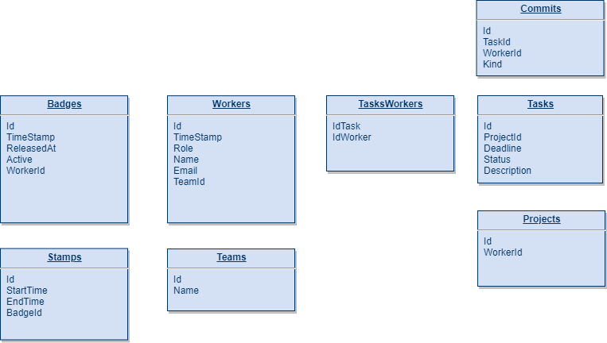

# README

This project is created for a WebFormat's test.
Text of test:

Si tratta di modellare una versione semplificata di ticket system o gestionale team con le seguenti caratteristiche:

1.       Un'azienda informatica ha degli impiegati

2.       Ogni impiegato ha un ruolo (CEO, PM, DEV)

3.       Ogni impiegato tranne il CEO è associato ad un team

4.       * Ogni impiegato ha un badge che usa per entrare / uscire dall'ufficio e registra i tempi di lavoro

5.       L'azienda lavora su progetti che il CEO assegna ad un PM

6.       Il PM per il progetto crea dei task che hanno una descrizione, uno status e una deadline (data entro la quale il task deve essere chiuso)

7.       Un task può essere assegnato ad uno o più sviluppatori (impiegato con ruolo DEV)

8.       * Un task può avere dei commit (messaggi o note) che sono fatti da uno sviluppatore

9.       Il CEO può assumere impiegati PM o DEV

Creare un'interfaccia (Web o CLI) per:
(NOTA: non è necessario sviluppare anche la parte di interfaccia utente)

1.       Assegnare un task ad uno sviluppatore

2.       Rimuovere un task da uno sviluppatore

3.       Mostrare tutti i task "in elaborazione" di uno sviluppatore

4.       Mostrare i progetti cross-team (un progetto è cross team se ha sviluppatori di almeno 2 team diversi che lavorano ai suoi task)

5.       *- Creare un nuovo DEV e assegnarlo ad un team

6.       Mostrare il PM di riferimento di un DEV

7.       *- Mostrare i task che hanno sforato la deadline con i DEV che ci hanno lavorato e i loro relativi commits

 

Parole chiave:

-          ORM

-          Database migration

-          Data seeding

-          Dependency Injection

 ---

Database:

 ---

There is a Postman collection in public directory with all tha application call.